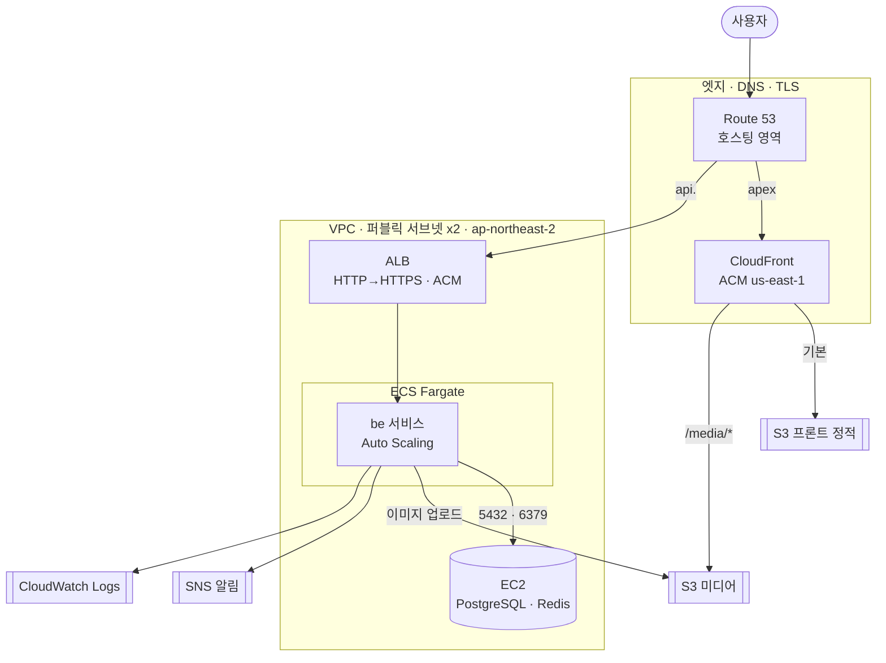

# PuppyTalk Infra

반려견 커뮤니티 **PuppyTalk**의 인프라(IaC) 레포입니다. Terraform으로 **AWS ECS Fargate**
운영 스택을 코드로 기술하고, 로컬 전체 스택은 `docker-compose`로 재현합니다.

- 백엔드: [PuppyTalk Backend](https://github.com/kyjness/2-kyjness-community-be)
- 프론트엔드: [PuppyTalk Frontend](https://github.com/kyjness/2-kyjness-community-fe)

---

## 배포 모델 — 두 트랙

| 트랙 | 정체 | 위치 | 상태 |
|------|------|------|------|
| **AWS 운영 설계** | ALB·ECS Fargate·CloudFront 등 운영 등급 토폴로지를 Terraform으로 기술 | 이 레포 `terraform/` | **설계 산출물** — 상시 과금(ALB·Fargate·EC2)을 피하려 기본적으로 `apply` 하지 않음 |
| **라이브 데모** | 실제 공개 URL로 돌아가는 데모 | be/fe 레포 | 무료 티어 관리형 서비스(Vercel·Fly·Neon·Upstash·R2)로 별도 구동 *(구성 예정)* |

> Terraform 스택은 "이렇게 운영 등급으로 설계했다"를 코드로 보여주는 산출물이고,
> 비용 0의 공개 데모는 무료 티어에서 별도로 돌립니다. 두 트랙은 독립적입니다.

---

## AWS 아키텍처 (`terraform/`)

리전 `ap-northeast-2`(서울), CloudFront용 ACM만 `us-east-1`. VPC + 퍼블릭 서브넷 2개(멀티 AZ),
IGW·퍼블릭 라우트 테이블.



### 컴포넌트별 선택 근거

| 컴포넌트 | 리소스 | 왜 이렇게 |
|----------|--------|-----------|
| **컨테이너 실행** | ECS Fargate (`ecs.tf`) | 서버리스 컨테이너 — EC2 노드·오토스케일러 관리 없이 태스크만 관리. `ecs_autoscaling.tf`로 CPU 70% 타깃 추적 오토스케일 |
| **로드밸런서** | ALB (`alb.tf`) | `api.<domain>` 종단 TLS + 80→443 리다이렉트. ECS는 ALB SG에서만 8000 수신(직접 노출 X) |
| **정적 프론트 + CDN** | CloudFront + S3 (`cloudfront.tf`, `frontend.tf`) | 정적 SPA는 S3(OAC로 **비공개**)에 두고 CloudFront로 전세계 캐시·TLS. `/media/*`는 미디어 버킷으로 라우팅 |
| **이미지 저장** | S3 media (`media.tf`) | 업로드 이미지 저장, CloudFront `/media/*` 경유 서빙. 앱은 Task Role로 해당 버킷만 접근(와일드카드 금지) |
| **DB · 캐시** | EC2 PostgreSQL·Redis (`ec2_db.tf`) | 포트폴리오 비용 절감을 위해 단일 EC2에 통합. SG로 ECS에서만 5432/6379 허용. **RDS·ElastiCache 전환은 다음 단계** |
| **비동기 알림** | SNS (`sns.tf`) | 알림 팬아웃. 앱(boto3)이 **Task Role**로 발행 — AK/SK 환경변수 불필요 |
| **로그** | CloudWatch Logs (`cloudwatch.tf`) | ECS awslogs 드라이버로 컨테이너 로그 수집 |
| **이미지 레지스트리** | ECR (`ecr.tf`) | AWS-native 레지스트리. `scan_on_push`로 취약점 검사 |
| **시크릿** | SSM Parameter Store (`ssm.tf`) | `JWT_SECRET_KEY`·`DB_PASSWORD`를 SecureString으로. 태스크 정의에 평문 미노출. Secrets Manager 대비 무료 티어로 충분 |
| **DNS · TLS** | Route 53 · ACM (`dns.tf`, `acm.tf`) | 호스팅 영역 + apex/`api.` 레코드. ACM DNS 검증. CloudFront 인증서는 `us-east-1` 별칭 프로바이더 |

### CI/CD — GitHub Actions + OIDC (정적 키 없음)

배포 자격은 장기 AK/SK 대신 **GitHub OIDC AssumeRole**로만 발급합니다 (`iam_github_oidc.tf`).

| 대상 | IAM Role | 권한 (최소) |
|------|----------|-------------|
| **FE** | `fe_github_actions` | S3 프론트 버킷 sync + CloudFront 무효화 |
| **BE** | `be_github_actions` | ECR push + `ecs:UpdateService`(지정 서비스 한정) |

> 이전에는 Jenkins EC2 인스턴스 프로파일이 BE 배포를 담당했으나, 상시 과금·이중 CD 경로를
> 없애고 **GitHub OIDC 한 갈래로 일원화**했습니다. 각 롤의 `sub` 조건으로 해당 레포 워크플로만
> Assume할 수 있습니다(`github_fe_oidc_subject`·`github_be_oidc_subject`).
>
> **참고**: `be_github_actions` 롤(ECR push + ECS 배포)은 이 AWS 스택을 `apply` 했을 때
> 활성화되는 CD 경로입니다. 무료 티어 라이브 데모 트랙에서는 BE 이미지를 GHCR로 빌드해
> Fly에 배포하므로, 이 롤은 AWS 스택을 적용하기 전까지는 휴면 상태입니다.

### 다음 단계 설계 (미구현, 서술만)

Current 스택을 확장할 방향:

- **EKS 전환**: ECS 서비스를 EKS Deployment/HPA + Argo Rollouts(블루/그린)로. 프라이빗 서브넷 +
  NAT, IRSA로 파드 단위 IAM.
- **관리형 데이터 계층**: EC2 PostgreSQL → **RDS(Multi-AZ)**, Redis → **ElastiCache**. 백업·페일오버 위임.
- **원격 상태**: 로컬 `tfstate` → **S3 백엔드 + DynamoDB 락**(팀 협업·상태 잠금).

---

## 로컬 개발 (Docker Compose)

루트 `docker-compose.local.yml`로 전체 스택(Nginx + 백엔드 + 프론트 + PostgreSQL + Redis +
MinIO)을 한 번에 띄웁니다.

### 1. 레포 배치

세 레포가 **같은 상위 폴더**에 있어야 빌드 컨텍스트가 맞습니다.

```
상위폴더/
├── 2-kyjness-community-be/
├── 2-kyjness-community-fe/
└── 2-kyjness-community-infra/   ← 여기서 실행
```

### 2. 환경 변수

```bash
cd 2-kyjness-community-infra
cp .env.example .env.local        # db · minio · backend 가 이 파일을 읽음 (.gitignore)
```

맞출 항목(자세한 키는 `.env.example`): `POSTGRES_*`, `MINIO_ROOT_*`, `DB_PASSWORD`,
`JWT_SECRET_KEY`(32자 이상 랜덤), `STORAGE_BACKEND`·`S3_*`·`S3_PUBLIC_BASE_URL`.

### 3. 기동 · 확인

```bash
docker compose -f docker-compose.local.yml up --build -d
```

백엔드 컨테이너 기동 시 `alembic upgrade head`가 자동 실행됩니다.

| 확인 | URL |
|------|-----|
| 프론트 | http://localhost |
| API | http://localhost/v1/ |
| Swagger | http://localhost/v1/docs |
| 헬스 | http://localhost/v1/health |

호스트 포트: Nginx `80`, PostgreSQL `5432`, Redis `6379`, MinIO API `9000`·콘솔 `9001`.
백엔드·프론트는 Nginx(80) 경유로 호스트 포트를 열지 않습니다.

### 4. MinIO 버킷 공개 (이미지 Access Denied 방지)

```bash
docker exec minio mc alias set myminio http://localhost:9000 minioadmin minioadmin
docker exec minio mc anonymous set download myminio/puppytalk   # 버킷명은 S3_BUCKET_NAME에 맞게
```

### 5. 종료

```bash
docker compose -f docker-compose.local.yml down       # 컨테이너만
docker compose -f docker-compose.local.yml down -v     # 볼륨(DB·Redis·MinIO)까지 초기화
```

---

## Terraform 사용 (참고)

> ⚠️ 이 스택을 `apply` 하면 ALB·Fargate·EC2 등이 **상시 과금**됩니다. 설계 검토 목적이면
> `validate`/`plan`까지만 실행하세요. 공개 라이브 데모는 무료 티어 트랙(be/fe 레포)을 사용합니다.

**AWS Provider `>= 5.40, < 6.0`**, 상태 파일은 로컬 `terraform.tfstate`(`.gitignore`).

> 🔐 `ssm.tf`가 시크릿 값(`jwt_secret_key`·`db_master_password`)을 관리하므로, 그 값은
> **`terraform.tfstate`에 평문으로 저장**됩니다. 상태 파일을 절대 커밋하지 말고(현재 `.gitignore`),
> 원격 상태로 옮길 때는 **암호화된 S3 백엔드(SSE) + 접근 제어**를 전제로 하세요.

### 사전 준비

1. Terraform CLI 설치.
2. AWS 자격 증명: 환경 변수(`AWS_ACCESS_KEY_ID`/`AWS_SECRET_ACCESS_KEY`, 선택 `AWS_SESSION_TOKEN`)
   또는 `aws configure`. **`terraform.tfvars`에 AK/SK를 넣지 않습니다.**
3. SSH 공개키: `ec2_db.tf`의 `aws_key_pair.deployer`가 `~/.ssh/id_rsa.pub`를 읽습니다.
4. 변수 파일: `terraform.tfvars.example` → `terraform.tfvars`(`.gitignore`) 복사 후 값 입력.

**반드시 채울 민감 값**(`variables.tf`):

| 변수 | 설명 |
|------|------|
| `db_master_password` | PostgreSQL `postgres` 사용자 비밀번호 (EC2 user_data + SSM SecureString) |
| `jwt_secret_key` | 백엔드 JWT 서명 키, 32자 이상 (SSM SecureString) |

`project_name`·`region`·`domain_name`·`github_*_oidc_subject`·오토스케일 값 등은 기본값이 있습니다.

### 명령

```bash
cd terraform
terraform init            # 프로바이더 다운로드 (최초 1회)
terraform validate        # 구성 검사
terraform plan            # 변경 계획 확인
# terraform apply         # (과금 주의) 실제 생성
```

- 적용 시 **Route 53** 호스팅 영역의 NS를 도메인 등록업체에 위임해야 `api.<domain>`·apex·ACM
  DNS 검증이 동작합니다.
- 출력: `terraform output` (ECR URL, DB IP, FE/BE OIDC 롤 ARN 등).
- 원격 상태(S3 백엔드)는 위 "다음 단계 설계" 참고.
