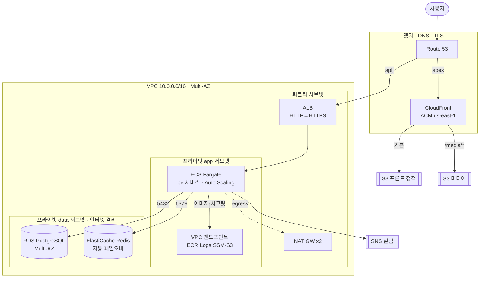

# PuppyTalk Infra

반려견 커뮤니티 **PuppyTalk**의 인프라(IaC) 레포입니다. Terraform으로 **AWS ECS Fargate**
운영 스택(1차 아키텍처)과 **EKS 대안 트랙**을 코드로 기술하고, 로컬 전체 스택은
`docker-compose`로 재현합니다.

- 백엔드: [PuppyTalk Backend](https://github.com/kyjness/2-kyjness-community-be)
- 프론트엔드: [PuppyTalk Frontend](https://github.com/kyjness/2-kyjness-community-fe)

---

## 배포 모델 — 설계와 실행의 분리

| 트랙 | 정체 | 위치 | 상태 |
|------|------|------|------|
| **AWS 운영 설계** | 프라이빗 3-tier·ALB·ECS Fargate·RDS·ElastiCache·CloudFront 등 운영 등급 토폴로지 | 이 레포 `terraform/`(+`eks/`) | **설계 산출물** — 상시 과금(ALB·Fargate·RDS·NAT)을 피하려 `apply` 하지 않음 |
| **라이브 데모** | 실제 공개 URL로 돌아가는 데모 | be/fe 레포 | 무료 티어(Vercel·Fly·Neon·Upstash·R2)로 별도 구동 *(구성 예정)* |

> Terraform 스택은 "이렇게 운영 등급으로 설계했다"를 코드로 증명하는 산출물이고(무료·미적용),
> 비용 0의 공개 데모는 무료 티어에서 별도로 돌립니다. **설계 깊이와 실제 과금은 별개 축**입니다.

---

## AWS 아키텍처 (`terraform/` — 1차: ECS Fargate)

리전 `ap-northeast-2`(서울), CloudFront용 ACM만 `us-east-1`. VPC `10.0.0.0/16`,
**3-tier**: 퍼블릭(ALB·NAT) / 프라이빗 app(ECS) / 프라이빗 data(RDS·Redis, 인터넷 격리).



### 컴포넌트별 선택 근거

| 컴포넌트 | 리소스 | 왜 이렇게 |
|----------|--------|-----------|
| **네트워크** | 프라이빗 3-tier + NAT (`vpc.tf`·`nat.tf`) | app(ECS)·data(DB) 계층 분리. data 티어는 **인터넷 경로 없음**(격리), app egress는 **AZ별 NAT**(HA) |
| **컨테이너 실행** | ECS Fargate (`ecs.tf`) | 서버리스 컨테이너 — 노드 관리 없이 태스크만. **프라이빗 서브넷 배치**(퍼블릭 IP 없음), `ecs_autoscaling.tf`로 CPU 70% 타깃 추적 |
| **로드밸런서** | ALB (`alb.tf`) | `api.<domain>` 종단 TLS + 80→443. ECS는 ALB SG에서만 8000 수신 |
| **정적 프론트 + CDN** | CloudFront + S3 (`cloudfront.tf`·`frontend.tf`) | 정적 SPA는 S3(OAC로 비공개) + CloudFront 캐시·TLS. `/media/*`는 미디어 버킷 |
| **이미지 저장** | S3 media (`media.tf`) | 업로드 이미지, CloudFront `/media/*` 서빙. 앱은 Task Role로 해당 버킷만 |
| **DB** | RDS PostgreSQL (`rds.tf`) | **Multi-AZ 자동 페일오버·gp3 암호화·자동 백업·performance insights**. data 티어, ECS SG에서만 5432 |
| **캐시·브로커** | ElastiCache Redis (`elasticache.tf`) | primary+replica **자동 페일오버·Multi-AZ·at-rest 암호화**. data 티어, ECS SG에서만 6379 |
| **VPC 엔드포인트** | S3 gateway + ECR/Logs/SSM interface (`vpc_endpoints.tf`) | 프라이빗 ECS가 이미지 pull·시크릿·로그를 **NAT/인터넷 없이 AWS 백본**으로 → 비용·노출 감소 |
| **비동기 알림** | SNS (`sns.tf`) | 앱(boto3)이 **Task Role**로 발행 — AK/SK 불필요 |
| **로그** | CloudWatch Logs (`cloudwatch.tf`) | ECS awslogs 드라이버 |
| **이미지 레지스트리** | ECR (`ecr.tf`) | AWS-native, `scan_on_push` |
| **시크릿** | SSM Parameter Store (`ssm.tf`) | `JWT_SECRET_KEY`·`DB_PASSWORD`를 SecureString으로 — 태스크 정의에 평문 미노출 |
| **DNS · TLS** | Route 53 · ACM (`dns.tf`·`acm.tf`) | 호스팅 영역 + apex/`api.` 레코드, ACM DNS 검증. CloudFront 인증서는 `us-east-1` |

### CI/CD — GitHub Actions + OIDC (정적 키 없음)

배포 자격은 장기 AK/SK 대신 **GitHub OIDC AssumeRole**로만 발급합니다 (`iam_github_oidc.tf`).

| 대상 | IAM Role | 권한 (최소) |
|------|----------|-------------|
| **FE** | `fe_github_actions` | S3 프론트 버킷 sync + CloudFront 무효화 |
| **BE** | `be_github_actions` | ECR push + `ecs:UpdateService`(지정 서비스 한정) |

> 이전에는 Jenkins EC2가 BE 배포를 담당했으나, 상시 과금·이중 CD 경로를 없애고 **GitHub OIDC
> 한 갈래로 일원화**했습니다. `be_github_actions`는 AWS 스택 `apply` 시 활성화되는 CD 경로 —
> 무료 라이브 데모 트랙은 BE 이미지를 GHCR→Fly로 배포하므로, 적용 전까지 이 롤은 휴면입니다.

---

## ECS vs EKS — 왜 둘 다 두었나 (판단 근거)

**ECS Fargate가 1차 아키텍처**, EKS(`eks/`)는 "동일 앱을 쿠버네티스로 운영한다면" 대안 설계입니다.
겉멋이 아니라 **선택지를 비교·판단할 수 있음을 보이려는** 것으로, 별도 root로 분리해 혼동을 막습니다.

| 관점 | ECS Fargate (1차) | EKS (`eks/`, 대안) |
|------|-------------------|--------------------|
| 운영 부담 | 낮음(서버리스, AWS 관리) | 높음(컨트롤플레인·애드온·업그레이드) |
| 생태계 | AWS 네이티브(ALB·IAM·CloudWatch 통합) | k8s 표준(Helm·Operator·Argo·metrics-server) |
| 이식성 | AWS 종속 | 멀티클라우드 이식 용이 |
| 배포 전략 | 롤링(+CodeDeploy 블루그린) | 롤링/HPA + **Argo Rollouts 블루그린** |
| 적합 규모 | 소~중규모, k8s 전문성 불필요 | k8s 표준·세밀 제어가 필요한 규모 |

**판단**: PuppyTalk 규모에는 ECS가 운영 부담·비용 대비 적정 → 1차로 채택. k8s 생태계가 필요해지는
시점을 대비해 EKS 경로를 **코드로 미리 설계**(`eks/`)해 두되 적용하지 않습니다. ("쓸 데·안 쓸 데 구분")

### `eks/` 구성 (별도 root)

- `eks/*.tf`: 전용 VPC(`10.1.0.0/16`, 커뮤니티 모듈) + **EKS 클러스터·관리형 노드그룹**
  (`terraform-aws-modules/eks`) + **Cluster Autoscaler IRSA**(파드 단위 IAM).
- `eks/k8s/`: `kubectl kustomize`로 렌더되는 매니페스트.
  - `base` + `overlays/prod-seoul`: Deployment·Service·HPA(롤링). 이미지는 GHCR, DB/Redis 엔드포인트는
    `terraform/`의 `rds_address`·`redis_primary_endpoint` output을 채워 연결.
  - `rollout-bluegreen`: **Argo Rollouts 블루그린**(active/preview) 대안 배포 전략.

### 실제 적용 시 전제 (미구현·서술)

- **원격 상태**: 로컬 `tfstate` → **암호화 S3 백엔드 + DynamoDB 락**(팀 협업·상태 잠금·시크릿 보호).
- **Redis in-transit TLS**: `transit_encryption_enabled=true` 시 `REDIS_URL`이 `rediss://`+auth_token 전제 → 앱 설정 연동 필요.

---

## 로컬 개발 (Docker Compose)

루트 `docker-compose.local.yml`로 전체 스택(Nginx + 백엔드 + 프론트 + PostgreSQL + Redis +
MinIO)을 한 번에 띄웁니다.

### 1. 레포 배치

세 레포가 **같은 상위 폴더**에 있어야 빌드 컨텍스트가 맞습니다.

```
상위폴더/
├── 2-kyjness-community-be/
├── 2-kyjness-community-fe/
└── 2-kyjness-community-infra/   ← 여기서 실행
```

### 2. 환경 변수

```bash
cd 2-kyjness-community-infra
cp .env.example .env.local        # db · minio · backend 가 이 파일을 읽음 (.gitignore)
```

맞출 항목(자세한 키는 `.env.example`): `POSTGRES_*`, `MINIO_ROOT_*`, `DB_PASSWORD`,
`JWT_SECRET_KEY`(32자 이상 랜덤), `STORAGE_BACKEND`·`S3_*`·`S3_PUBLIC_BASE_URL`.

### 3. 기동 · 확인

```bash
docker compose -f docker-compose.local.yml up --build -d
```

백엔드 컨테이너 기동 시 `alembic upgrade head`가 자동 실행됩니다.

| 확인 | URL |
|------|-----|
| 프론트 | http://localhost |
| API | http://localhost/v1/ |
| Swagger | http://localhost/v1/docs |
| 헬스 | http://localhost/v1/health |

호스트 포트: Nginx `80`, PostgreSQL `5432`, Redis `6379`, MinIO API `9000`·콘솔 `9001`.

### 4. MinIO 버킷 공개 (이미지 Access Denied 방지)

```bash
docker exec minio mc alias set myminio http://localhost:9000 minioadmin minioadmin
docker exec minio mc anonymous set download myminio/puppytalk   # 버킷명은 S3_BUCKET_NAME에 맞게
```

### 5. 종료

```bash
docker compose -f docker-compose.local.yml down       # 컨테이너만
docker compose -f docker-compose.local.yml down -v     # 볼륨까지 초기화
```

---

## Terraform 사용 (참고)

> ⚠️ 이 스택을 `apply` 하면 ALB·Fargate·**RDS·ElastiCache·NAT** 등이 **상시 과금**됩니다.
> 설계 검토는 `validate`/`plan`까지만. 공개 라이브 데모는 무료 티어 트랙(be/fe 레포)을 씁니다.

**AWS Provider `>= 5.40, < 6.0`**, 상태 파일은 로컬 `terraform.tfstate`(`.gitignore`).

> 🔐 `ssm.tf`·`rds.tf`가 시크릿(`jwt_secret_key`·`db_master_password`)을 관리하므로 그 값은
> **`terraform.tfstate`에 평문 저장**됩니다. 상태 파일을 절대 커밋하지 말고(현재 `.gitignore`),
> 원격 상태로 옮길 때는 **암호화 S3 백엔드(SSE) + 접근 제어**를 전제로 하세요.

### 사전 준비

1. Terraform CLI 설치.
2. AWS 자격 증명: 환경 변수 또는 `aws configure`. **`terraform.tfvars`에 AK/SK를 넣지 않습니다.**
3. 변수 파일: `terraform.tfvars.example` → `terraform.tfvars`(`.gitignore`) 복사 후 값 입력.

**반드시 채울 민감 값**(`variables.tf`):

| 변수 | 설명 |
|------|------|
| `db_master_password` | RDS 마스터 비밀번호 (SSM SecureString으로 ECS에도 주입) |
| `jwt_secret_key` | 백엔드 JWT 서명 키, 32자 이상 (SSM SecureString) |

`project_name`·`region`·`domain_name`·`github_*_oidc_subject`·`rds_*`·`elasticache_*`·오토스케일 값 등은 기본값이 있습니다.

### 명령

```bash
# 1차 스택 (ECS)
cd terraform
terraform init && terraform validate      # 구성 검사
terraform plan                            # 변경 계획 (실계정 자격 필요)
# terraform apply                         # (과금 주의)

# EKS 대안 트랙
cd ../eks
terraform init && terraform validate
kubectl kustomize k8s/overlays/prod-seoul # 매니페스트 렌더 확인(클러스터 불필요)
```

- 적용 시 **Route 53** 호스팅 영역 NS를 도메인 등록업체에 위임해야 `api.<domain>`·apex·ACM 검증이 동작.
- 출력: `terraform output` (`ecr_be_repository_url`·`rds_address`·`redis_primary_endpoint`·FE/BE OIDC 롤 ARN 등).
